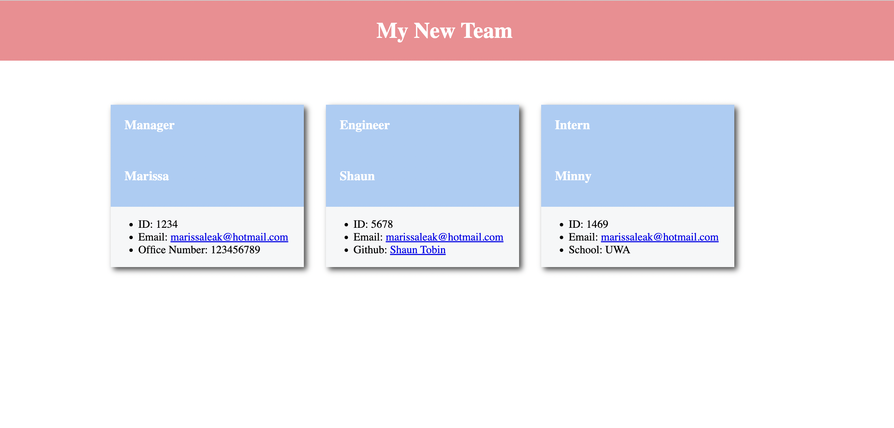

<h1 align="center">Employee Generator</h1>
   
  
<p align="center">
    
    
    
    
</p>
  
<p align="center">
    
    
    
    
    
    
    

</p>
   
## Description
  
🔍 A node.js application that uses user input from inquirer to populate an index.html file that shows all employees on the team in a card format.  


🎥 The full movie file showing functionality of the application can be found [here](https://drive.google.com/file/d/1Ay2rsbqZdYLlUcZzr6XAMz333rv4MGr6/view)<br/>
📁 The html file is created in the main directory and can be found [here](index.html)



## User Story
  
```
AS A manager
I WANT to generate a webpage that displays my team's basic info
SO THAT I have quick access to their emails and GitHub profiles
```
  
## Table of Contents
- [Installation](#installation)
- [Usage](#usage)
- [Contributing](#contributing)
- [Contact](#contact)

## Installation
💾 Run the following commands to install this application
  
`npm init`
  
`npm i inquirer`

`npm i -D jest`
  
## Usage
💻 Run the following command at the root of your project and answer the prompted questions:
  
`node index.js`

## Contributing
[Marissa Krantz](https://github.com/marissakrantz)

## Contact
✉️ Contact me with any questions: [email](mailto:marissaleak@hotmail.com) , [GitHub](https://github.com/marissakrantz)<br />